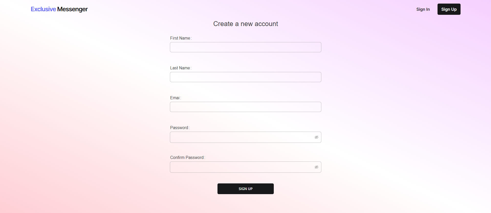
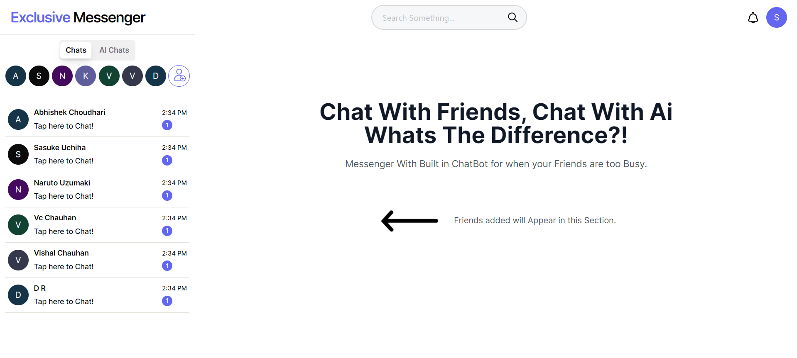
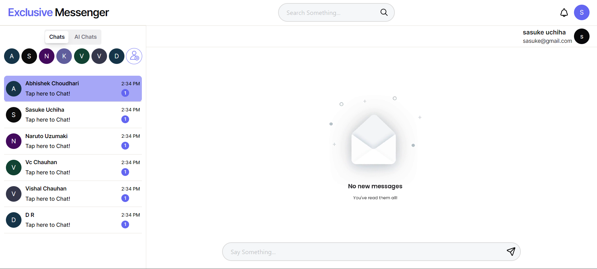
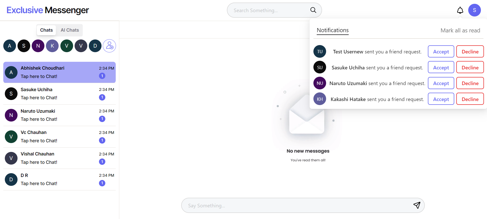
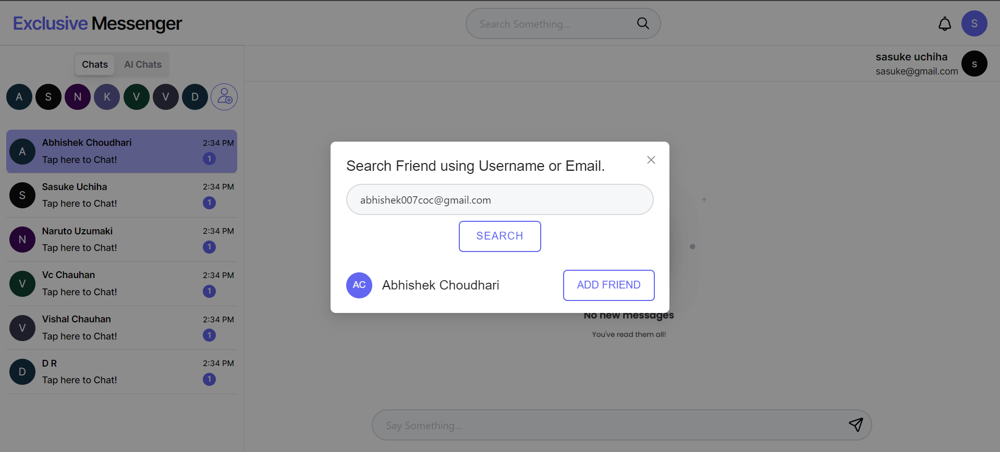
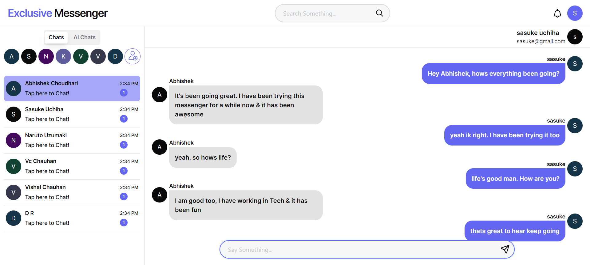

<h1>Exclusive Messenger(NextJS-ExpressJS) Project</h1>

<h1><a href = "https://exclusive-messenger.up.railway.app/">Live Demo</a></h1>

Exclusive Messenger is a Full-Stack Real-Time Web Chat Application built using NextJS-ExpressJS Stack.

<h2>List of Technologies, Frameworks & Libraries used.</h2>
<ul>
        <li>NextJS</li>
        <li>ExpressJS(NodeJS)</li>
        <li>Socket IO</li>
        <li>MongoDB Atlas</li>
        <li>Mongoose</li>
        <li>Tailwind CSS</li>
        <li>Yarn(Package Manager)</li>
        <li>GIT/GitHub</li>
</ul>

<h2>Features Implemented</h2>
<ul>
        <li><strong>User Registration: </strong>Validating and Storing Users in the MongoDB Atlas.</li>
        <li><strong>User Authentication: </strong>Handling User Authentication and Session using JWT Web Token.</li>
        <li><strong>Real-Time Comms </strong>Used Socket.io to handle Bidirectional Communication.</li>
        <li><strong>Session Management </strong>Cookie Based JWT Web Tokens to manage User Session.</li>
        <li><strong>UI: </strong>Built UI using NextJS, Tailwind CSS & ANTD Comp. Library.</li>
        <li><strong>Routing: </strong>NextJS' Latest App Router.</li>
        <li><strong>Database Integration: </strong>Using Mongoose & MongoDB Atlas to handle interactions of Back-End with DB & Store Data.</li>
        <li><strong>RESTful API: </strong>Developed APIs to handle Incoming Network Requests from Front-End.</li>
        <li><strong>Dependency: </strong>Yarn for managing various project dependencies.</li>
        <li><strong>Version Control: </strong>GIT/GitHub for Version Control.</li>
</ul>

<h2>Project Snapshots:-</h2>

 

 

 

 

 

 

